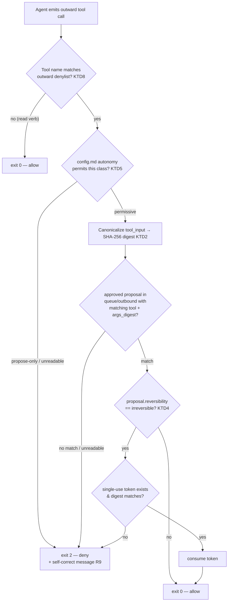

# feat: Outward-Action Gate — Structural Enforcement of Propose-Never-Act

## Summary

Build a `PreToolUse` gate — the deterministic, non-LLM twin of the existing memory-provenance guard (`engine/eval/hooks/provenance_check.py`) — that denies any outward connector tool call unless the autonomy dial permits it **and** a payload-matched approved proposal exists in `instance/queue/outbound/`. Matching is payload-bound (canonical-args digest); irreversible actions additionally consume a single-use token. Ships default-on and fail-closed, wired by `cos-onboarding`. Layers 1 (read-only OAuth scopes) and 3 (sandbox egress deny) are specified as required companion posture, not implemented here.

---

## Problem Frame

`INSTRUCTIONS.md` §1 ("propose, never act") is the flagship safety rule and the only safety-critical rule with **no structural enforcement**. The extractor is sandbox-isolated (`engine/docs/write-isolation-config.md`); `core/` edits and fact provenance are guarded by `engine/eval/hooks/provenance_check.py`. But outward actions rely entirely on the model *choosing* to write a proposal instead of calling a mutating connector tool. The moment a write OAuth scope is granted — so the agent *can* execute approved sends — nothing structurally ties an outward tool call to an approved proposal. A mistake or an injected instruction can act outward directly.

Per `engine/methods/write-back.md` §8.2 ("you can't scan your way out"), the answer is structural and deterministic, not an LLM reviewer. "Was this outward action backed by an approved proposal?" is a deterministic question and gets a deterministic gate. (See origin: `docs/brainstorms/2026-06-10-outward-action-gate-requirements.md`.)

---

## Requirements

- **R1** — Deny any outward (mutating) connector tool call that lacks a payload-matched approved proposal, before it executes (`PreToolUse`, not corrective).
- **R2** — Matching is payload-bound: one approval authorizes exactly one action; editing any field of an approved proposal fails the match and re-queues.
- **R3** — Irreversible actions (`reversibility: irreversible`) additionally require a single-use token, consumed on execution, so an identical payload cannot be sent twice.
- **R4** — The gate reads the autonomy dial; at the default `propose-only` level it denies all gated calls (agent never executes outward — the principal does). Permissive levels allow matched calls.
- **R5** — Fail-closed: if config, queue, or a proposal can't be read or parsed, deny.
- **R6** — Inward/read tool calls (`list_*`, `get_*`, `search_*`, `read_*`) pass untouched; the gate only intercepts mutating verbs.
- **R7** — Default-on: `cos-onboarding` wires the gate into the instance's `.claude/settings.json` and selects the surface-appropriate enforcement (CLI hook / Cowork read-only posture / Codex permissions-profile).
- **R8** — The outward tool set is config-driven (a denylist of tool-name patterns), not hardcoded.
- **R9** — Denial feedback is surfaced to the model (stderr + exit 2) so it self-corrects into writing a proposal.
- **R10** — No regression to the existing inward provenance guard.

**Success criteria** (from origin): direct `create_event` with no matching proposal → denied; matched call → allowed; edited proposal → match fails; irreversible action cannot execute twice; unreadable config/queue → all outward denied; Cowork read-only → cannot mutate regardless of hook; provenance hook unchanged.

---

## Key Technical Decisions

- **KTD1 — PreToolUse, not PostToolUse.** Outward sends are often irreversible; a corrective post-write check (like the provenance hook) is too late. The gate must block before execution. *Consequence:* the gate is a Claude Code construct; other surfaces use their own pre-execution mechanism (see Cross-Surface Enforcement).
- **KTD2 — Payload-bound matching via canonical-args digest.** Canonicalize `tool_input` (sorted keys, trimmed whitespace, timestamps normalized to UTC ISO-8601, email addresses lowercased), hash with SHA-256, compare to the proposal's stored `args_digest`. Content-bound, so it survives id spoofing and catches drift. Presence-only matching was rejected (origin) as replay-prone.
- **KTD3 — Proposal↔call linkage is digest-first.** The gate scans `instance/queue/outbound/*.md` for an `approved` proposal whose declared `tool` matches the call and whose `args_digest` equals the recomputed digest. A proposal `id` is recorded for logging, not used as the authorization key (an MCP call can't carry a custom id argument anyway).
- **KTD4 — Single-use token for irreversible only.** On approval of an `irreversible` proposal, a token file is minted under `instance/queue/outbound/.tokens/<proposal-id>` containing the `args_digest`; the gate verifies digest-match then deletes (consumes) it. Reversible actions use digest match alone. Keeps routine reversible sends light while making accidental double-irreversible-send structurally impossible.
- **KTD5 — Dial unifies §1 and §8.** The gate reads `autonomy:` from `instance/config.md`. Default `propose-only` → deny all gated tools outright (the agent cannot execute even an approved proposal; the principal executes). Permissive levels → allow on match. The proposal `status` stays `approved`; the dial is what makes `approved` executable.
- **KTD6 — Hook home: beside `provenance_check.py`.** Ship the gate in `engine/eval/hooks/` for consistency with the existing referenced hook. The "eval/" naming wart and a possible move to `engine/hooks/` are deferred (see Scope Boundaries).
- **KTD7 — Reuse `engine/eval/lib/frontmatter.py`.** Proposal frontmatter parsing (status, reversibility, tool, args_digest) reuses the existing pyyaml-with-fallback reader; shared queue/digest helpers go in a new `engine/eval/lib/` module.
- **KTD8 — Config-driven outward denylist.** A tool-name pattern list (e.g., `*__create_event`, `*__update_event`, `*__delete_event`, `*__*send*`, `*__create_shared_link`, Dropbox/Drive `move`/`delete`) lives in the gate config so new connectors are covered by adding a pattern, not editing code. `create_draft` is treated inward only if not auto-sent (verify at build).

---

## Cross-Surface Enforcement

The invariant is the *principle* (no outward action without an approved proposal), enforced by the strongest mechanism each surface offers. The `PreToolUse` hook is Claude Code's mechanism only.

| Layer | Mechanism | CLI | Cowork | Codex |
|---|---|---|---|---|
| 1. Read-only OAuth scopes | provider-enforced | ✅ | ✅ primary posture | ✅ |
| 2. Per-proposal payload-bound gate | `PreToolUse` hook | ✅ full | ⚠️ likely, unverified | ❌ no hook → approval-policy |
| 3. Bash-egress deny | OS sandbox network/exec | ✅ | ⚠️ unverified | ✅ `network.enabled=false` |

**Non-promise (carried from origin):** payload-bound matching (KTD2) is a Claude Code capability, *not* a cross-platform guarantee. On surfaces without a pre-tool hook the enforced floor degrades to read-only scopes + human approval — still propose-never-act, without the automated fine-grained match. The plan must not claim the gate works identically everywhere.

**The honest limit:** the gate watches MCP tool names; it does not watch `Bash` (`curl`, `osascript`, `gcloud` route around it). The structural floor is all three layers together. This plan builds layer 2 and *specifies* layers 1 and 3 as required onboarding posture (U6).

---

## High-Level Technical Design

Outward tool call lifecycle through the gate (Claude Code):

Every ambiguous or error branch routes to DENY (R5, fail-closed).

---

## Implementation Units

### U1. Proposal template — machine-readable action block

- **Goal:** extend `engine/templates/proposal.md` so an approved proposal declares the exact action a digest can be computed from.
- **Requirements:** R2, R3, KTD2, KTD3.
- **Dependencies:** none.
- **Files:** `engine/templates/proposal.md` (modify).
- **Approach:** add a fenced, machine-readable block to the proposal frontmatter/body declaring `tool:` (the MCP tool name), `args:` (the canonical call arguments), and `args_digest:` (SHA-256 of the canonicalized args). Keep the existing human-readable "What / To whom / Exact text" prose — the block is derived from it, not a replacement. Document that editing the human text without regenerating the digest will (correctly) fail the gate match.
- **Patterns to follow:** existing frontmatter shape in `engine/templates/*.md`; `status: pending | approved | rejected | sent` and `reversibility:` already present.
- **Test scenarios:** Test expectation: none — template/doc change, behavior is exercised by U2–U4 fixtures.
- **Verification:** a sample approved proposal carries `tool`, `args`, `args_digest`; the digest is reproducible by U2's canonicalizer.

### U2. Canonicalization + digest + queue-match library

- **Goal:** the deterministic core — turn a live `tool_input` into a canonical digest and find a matching approved proposal.
- **Requirements:** R2, R5, R6, R8, KTD2, KTD3, KTD7, KTD8.
- **Dependencies:** U1.
- **Files:** `engine/eval/lib/outbound.py` (create), `engine/eval/lib/frontmatter.py` (reuse), test `engine/eval/lib/test_outbound.py` (create).
- **Approach:** pure functions, no I/O side effects beyond reading the queue: `canonicalize(args) -> bytes` (sorted keys, whitespace trim, UTC ISO-8601 timestamps, lowercased emails), `digest(args) -> str` (SHA-256 hex), `is_outward(tool_name, patterns) -> bool` (glob match against the config denylist), `find_approved_match(queue_dir, tool_name, digest) -> Proposal | None` (scan `queue/outbound/*.md`, parse frontmatter, return the proposal whose `status==approved` and `tool`+`args_digest` match). Every read wrapped so parse/IO failure raises a typed error the caller treats as deny (R5).
- **Patterns to follow:** `engine/eval/lib/frontmatter.py` (pyyaml + fallback), `provenance_check.py` path/payload handling.
- **Test scenarios:**
  - Happy: identical args in two key orders → same digest; matching approved proposal found.
  - Canonicalization: differing whitespace / timezone representations of the same instant → same digest; lowercased vs mixed-case email → same digest.
  - Edge: empty args; nested args; non-ASCII body text.
  - Drift: proposal text edited after digest computed → recomputed digest differs → no match.
  - Denylist: `*__create_event` matches; `*__list_events` does not (R6).
  - Failure: malformed proposal frontmatter / unreadable queue dir → typed error (caller denies) (R5).
- **Verification:** `test_outbound.py` passes; no network or memory writes performed by the lib.

### U3. The PreToolUse gate hook

- **Goal:** the executable guard wiring U2 + dial + token into a `PreToolUse` decision.
- **Requirements:** R1, R4, R5, R6, R9, KTD1, KTD5.
- **Dependencies:** U2, U4 (token check).
- **Files:** `engine/eval/hooks/outbound_gate.py` (create), test `engine/eval/hooks/test_outbound_gate.py` (create).
- **Approach:** mirror `provenance_check.py` structure — read JSON payload on stdin (`tool_name`, `tool_input`), `_norm`/`_payload` helpers, BLOCK = `exit 2` with stderr, ALLOW = `exit 0`. Flow per High-Level Technical Design: non-outward → allow; read `autonomy:` from `instance/config.md` (unreadable → deny); `propose-only` → deny gated calls with a self-correct message pointing to `engine/templates/proposal.md` (R9); permissive → compute digest, `find_approved_match`; irreversible → require token (U4); any error/ambiguity → deny (R5).
- **Patterns to follow:** `engine/eval/hooks/provenance_check.py` (two-tier exit, stdin payload, `isatty` guard, leading-slash-agnostic paths).
- **Test scenarios:**
  - Covers success criteria: outward call, no matching proposal → exit 2 with self-correct message.
  - Matched reversible proposal at permissive dial → exit 0.
  - Matched proposal at `propose-only` dial → exit 2 (R4).
  - Read verb (`list_events`) at any dial → exit 0 (R6).
  - Unreadable/absent `config.md` → exit 2 (R5).
  - Unreadable/absent queue → exit 2 (R5).
  - Non-tty with empty stdin → exit 0 (don't hang; mirror provenance hook).
  - Denial message names the proposal route (R9).
- **Verification:** hook test suite passes; manual probe with a crafted payload denies/allows as expected.

### U4. Single-use token lifecycle for irreversible actions

- **Goal:** make an accidental double-send of an irreversible action structurally impossible.
- **Requirements:** R3, KTD4.
- **Dependencies:** U1, U2.
- **Files:** `engine/eval/lib/outbound.py` (extend), test `engine/eval/lib/test_outbound.py` (extend).
- **Approach:** `mint_token(queue_dir, proposal)` writes `queue/outbound/.tokens/<proposal-id>` containing the `args_digest` (called at approval time — document where approval happens; see Open Questions). `consume_token(queue_dir, proposal_id, digest) -> bool` verifies the token exists and its digest matches, deletes it, returns True; missing/mismatched → False (caller denies). Token dir is created on first mint; absence is deny-by-default for irreversible.
- **Patterns to follow:** atomic file delete; treat a partially-written token as invalid (digest mismatch → deny).
- **Test scenarios:**
  - Happy: mint → consume succeeds once; second consume of same id → False (R3).
  - Mismatch: token digest ≠ call digest → False (no consume).
  - Missing token for irreversible proposal → False.
  - Concurrent/duplicate consume attempts → at most one succeeds.
- **Verification:** token tests pass; an irreversible action cannot execute twice end-to-end.

### U5. Gate configuration (denylist + defaults)

- **Goal:** make the outward tool set and gate behavior config-driven, not hardcoded.
- **Requirements:** R8, KTD8.
- **Dependencies:** none (consumed by U2/U3).
- **Files:** gate config file shipped with the engine (e.g., `engine/eval/hooks/outbound_gate.config.json` — create), referenced by `engine/docs/` (modify/create doc note).
- **Approach:** a small JSON/YAML file listing outward tool-name glob patterns and the fail-closed default. Document the verify-at-build step to confirm exact MCP tool names per connector (KTD7-style, per `engine/methods/connectors.md`). The hook loads this; an unreadable/malformed config means deny-all-outward (fail-closed, R5), not allow-all.
- **Patterns to follow:** `engine/eval/hooks/settings.example.json` shape and the connectors.md verify-at-build discipline.
- **Test scenarios:**
  - Default patterns match the known mutating verbs (create/update/delete_event, sends, shares) and not read verbs.
  - Malformed config → gate denies all outward (asserted via U3 test using a bad config).
- **Verification:** patterns cover the bundled connectors' mutating tools; unknown config fails closed.

### U6. Onboarding wiring — default-on, fail-closed, surface-aware

- **Goal:** ship the gate enabled by default and select the right enforcement per runtime.
- **Requirements:** R7, and the layer-1/layer-3 posture from Cross-Surface Enforcement.
- **Dependencies:** U3, U5.
- **Files:** `engine/skills/cos-onboarding/SKILL.md` (modify), `engine/eval/hooks/settings.example.json` (modify — add the `PreToolUse` block), `engine/docs/write-isolation-config.md` (modify — cross-reference the outward gate as the layer-2 companion).
- **Approach:** add an onboarding step that, after runtime detection (existing KTD-5 detect-or-ask in `engine/methods/connectors.md`), wires the surface-appropriate enforcement: **CLI** → write the `PreToolUse` matcher (`Write|Edit` already exists for provenance; add the MCP-tool matcher invoking `outbound_gate.py`) into the instance `.claude/settings.json`; **Cowork** → guide the principal to keep outward connectors read-only at the OAuth consent screen (layer 1 carries the weight) and note the hook may also apply but is unverified; **Codex** → specify the permissions-profile + approval-policy analog (see U7). Reaffirm the read-only-scope and sandbox-egress posture (layers 1, 3) as required, not optional.
- **Patterns to follow:** the existing onboarding extractor-profile wiring step (`SKILL.md` ~line 106) and `engine/eval/hooks/settings.example.json`.
- **Test scenarios:** Test expectation: none directly testable in the eval harness (documentation + settings wiring); validated by U8 scenario asserting the wired settings shape and by manual onboarding dry-run.
- **Verification:** a fresh CLI onboarding produces a `.claude/settings.json` containing the outbound-gate `PreToolUse` entry; Cowork/Codex paths produce the documented guidance.

### U7. Codex / Cowork enforcement spec + verify-at-build spike

- **Goal:** define the non-CLI enforcement and resolve the open Codex pre-tool-hook question.
- **Requirements:** Cross-Surface Enforcement, R7.
- **Dependencies:** U3.
- **Files:** `engine/docs/write-isolation-config.md` (modify — add an "outward enforcement" section paralleling the extractor isolation), or a new `engine/docs/outward-gate-config.md` (create).
- **Approach:** document the Codex analog — a restricted acting permissions-profile that either omits the mutating MCP server or uses Codex's approval policy for per-tool human approval; note Codex fails closed. Carry the verify-at-build (KTD-7) spike: *does Codex expose any pre-tool-call script hook?* If yes, port the gate; if no, enforcement stays read-only-scopes + approval-policy (coarser, documented as such). State the Cowork "honors settings.json hooks?" item as unverified (2026-06) with the read-only fallback.
- **Patterns to follow:** the Codex section of `engine/docs/write-isolation-config.md` (permissions-profile, `network.enabled=false`, fail-closed); connectors.md verify-at-build banner.
- **Test scenarios:** Test expectation: none — spec + spike doc. The spike's outcome may spawn a follow-up implementation unit.
- **Verification:** doc states the Codex/Cowork posture and the explicit non-promise; the spike question is recorded with how to verify.

### U8. Eval scenario — outward gate end-to-end

- **Goal:** lock the behavior into the existing eval harness so regressions are caught.
- **Requirements:** R1–R6, R9, R10.
- **Dependencies:** U2, U3, U4, U5.
- **Files:** `engine/eval/scenarios/02-outward-gate/` (create: `README.md`, `expected.yaml`, fixture `queue/outbound/` proposals, a crafted-payload turn), reusing `engine/eval/lib/assertions.py`.
- **Approach:** mirror `engine/eval/scenarios/01-write-back-loop/` structure. Fixtures: an approved reversible proposal (gate allows the matching call), an approved irreversible proposal + token (allows once, denies twice), an unmatched call (denies), a read call (allows), a `propose-only` config (denies even matched). Assert exit codes / decisions via the hook.
- **Patterns to follow:** `engine/eval/scenarios/01-write-back-loop/expected.yaml`, `engine/eval/run_scenario.py`.
- **Test scenarios:**
  - Covers R1: unmatched outward call denied.
  - Covers R2: edited-proposal call denied.
  - Covers R3: irreversible allowed once, denied on replay.
  - Covers R4: matched call denied at `propose-only`.
  - Covers R6: read verb allowed.
  - Covers R10: provenance scenario (01) still passes unchanged.
- **Verification:** `run_all.py` green including the new scenario and the unchanged provenance scenario.

---

## Scope Boundaries

**In scope:** the gate hook (U3), its deterministic lib (U2), the token lifecycle (U4), the proposal-template action block (U1), the config-driven denylist (U5), onboarding default-wiring (U6), the Codex/Cowork spec + spike (U7), and an eval scenario (U8).

**Required companion posture — specified, not implemented:** read-only OAuth scopes (layer 1) and sandbox network/exec deny (layer 3). These already exist as patterns (`engine/methods/connectors.md`, `engine/docs/write-isolation-config.md`); U6/U7 reaffirm them as required, but no new implementation lands here.

### Deferred to Follow-Up Work
- **Default-wiring the existing memory-provenance hook.** It's opt-in (`settings.example.json`) today; since U6 touches `settings.json`, default-wiring it is a natural adjacent improvement — held out of this plan's scope (origin scoped to the outward gate). One-line follow-up once U6 lands.
- **Hook home rename.** Possible move of both hooks from `engine/eval/hooks/` to a production `engine/hooks/` dir to shed the "eval" naming wart (KTD6). Mechanical; deferred to avoid churning the referenced path mid-feature.
- **Porting the gate to Codex** if the U7 spike finds a pre-tool-hook surface.

---

## Risks & Dependencies

- **Canonicalization brittleness (highest risk).** Too strict → legitimate sends over-block (principal frustration); too loose → drift slips through. Mitigation: U2's canonicalization is explicit and unit-tested across whitespace/timezone/case; start strict, loosen only with a test proving the equivalence is safe.
- **Approval-time token minting location (KTD4) depends on where "approval" happens.** Today approval is a human editing `status:` in the queue file; nothing mints tokens. Resolved as an Open Question below — U4 provides the functions; U6/onboarding documents the trigger.
- **MCP tool-name accuracy (KTD8).** Exact tool names per connector are verify-at-build (connectors.md KTD-7). A wrong/missing pattern silently un-gates a tool — mitigated by fail-closed defaults and the U8 scenario asserting the known set.
- **Cowork hook honoring unverified (2026-06).** Mitigated by the layer-1 read-only fallback (U6/U7) — the design does not depend on it.
- **Dependency:** reuses `engine/eval/lib/frontmatter.py` and the eval harness (`run_scenario.py`, `assertions.py`).

---

## Open Questions (planning-resolved or deferred to execution)

- **Where is a proposal "approved," and what mints the token?** (Execution-time.) Options: a human sets `status: approved` in the queue file (then a tiny `cos-` step or onboarding-documented manual action mints the irreversible token), or a future approval skill does both. U4 provides `mint_token`/`consume_token`; the *trigger* is documented in U6 and finalized during execution once the approval flow is exercised.
- **Does Codex expose a pre-tool-call script hook?** (U7 verify-at-build spike.) Determines whether payload-bound matching is reachable on Codex or enforcement stays approval-policy-only.
- **`create_draft` classification** — inward (a draft isn't sent) vs. gated if the connector auto-sends. Verify the actual connector behavior at build (U5).

### Known limitations surfaced in code review (2026-06-10)

These are real and out of this plan's scope; tracked for follow-up so they aren't mistaken for coverage:

- **Queue integrity is unguarded.** The gate trusts `status: approved` in `queue/outbound/`. Writing such a file is an inward write to `queue/` — guarded by neither this hook nor `provenance_check.py` (which only watches `instance/memory/`). A capable injection that can write files could forge an approved proposal (and, for irreversible, the `.tokens/` file). The gate closes the **direct-tool-call** bypass; queue-write integrity is a separate surface. Follow-up: gate `queue/outbound/` writes, or sign approvals.
- **Bash / WebFetch egress is not gated.** The hook matcher is `mcp__.*`; `curl`, `osascript`, `gh`, `git push`, and state-changing `WebFetch` bypass a tool-name gate. Closed only by layer 3 (sandbox network/exec deny) + layer 1 (read-only scopes) — restated as required in U6/U7, not implemented here.
- **Denylist is fail-open by classification.** Any mutating MCP verb not enumerated in `outbound_gate.config.json` passes ungated (the rest of the gate is fail-closed). Mitigated by over-gating + the `test_real_config_breadth` pin; audit per connector at build (KTD-7).
- **Irreversible token has no automated minter.** Until the approval flow mints `.tokens/<id>` on approval (the open question above), every irreversible proposal is denied (fail-safe). The minting trigger is the remaining piece of the approval flow.
- **`CLAUDE_PROJECT_DIR` must be set.** If unset, the gate resolves `instance/` against cwd; normally this denies (config unreadable), but a cwd that happens to hold a permissive instance could authorize against the wrong queue. Claude Code sets this; document the assumption.

---

## Sources & Research

- Origin requirements: `docs/brainstorms/2026-06-10-outward-action-gate-requirements.md`.
- Pattern: `engine/eval/hooks/provenance_check.py`, `engine/eval/hooks/settings.example.json`, `engine/eval/lib/frontmatter.py`.
- Contract: `engine/INSTRUCTIONS.md` §1/§8/§9, `engine/methods/write-back.md` §8.2, `engine/templates/proposal.md`.
- Cross-surface: `engine/docs/write-isolation-config.md`, `engine/methods/connectors.md`.
- No external research (settled mechanism, strong local pattern). No `docs/solutions/` learnings present.
