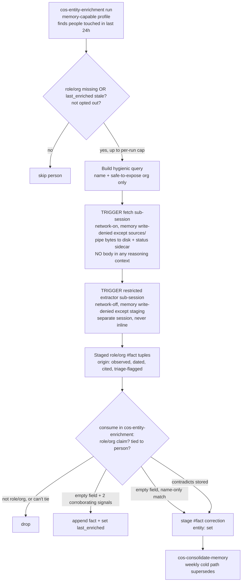

# feat: Person record web enrichment in the daily entity pipeline

## Summary

Add public-web enrichment of person records to the daily entity pipeline, triggered inside `cos-entity-enrichment`'s existing run with no new scheduled task. For people touched in the last 24h whose role/org is missing or whose record hasn't been web-enriched within a staleness window, the skill *triggers* the two-step isolation `cos-research` uses — a separate network-on sub-session pipes public results to `sources/web/`, a separate restricted network-off extractor stages tuples, then the skill consumes them append-only. `cos-entity-enrichment` itself never fetches or reasons over raw bytes. Scope is narrow: capture job/role/org changes only.

---

## Problem Frame

`semantic/people/` only learns what flows through the principal's own email, calendar, docs, and transcripts. A contact who changes jobs or moves companies leaves no trace there until they happen to mention it, so person records silently drift stale and the principal walks into meetings with an out-of-date picture of who someone is.

`cos-research` already proves the safe pattern for pulling untrusted web content into memory — a network-on fetch-to-file step that never reasons over page bodies, followed by a network-off extraction pass — but it is weekly and scoped to competitors and concepts. People get no equivalent. This brings that machinery to person records on the daily cadence without weakening the isolation that keeps web text out of memory-writing contexts.

---

## Key Technical Decisions

- KTD-1. **`cos-entity-enrichment` *triggers* the two-step within its existing run; it never fetches or extracts in its own profile, and no new scheduled task is added.** The skill's normal profile is memory-capable, so it must never hold network access and a raw page body at the same time. Within its 18:30 run it (1) selects candidates by reading memory, (2) triggers a *separate* network-on, memory-restricted sub-session that pipes pages to `sources/web/`, (3) triggers the *separate* network-off restricted extractor sub-session, then (4) consumes staging. This honors the principal's "no separate enrichment task" constraint (everything happens inside the existing daily run) while keeping isolation by topology, not by discipline. It uses the on-demand restricted-run mechanism `cos-extract-from-sources` already documents, extended to cover the network-on fetch. This **overrides** the origin's "the web fetch rides the front of the chain, never inside `cos-entity-enrichment`": the fetch is still never reasoned over inside the skill — it runs in a triggered sub-session — but ownership/triggering lives in the daily run rather than a separate scheduled step (reconciles origin's "never inside" decision with the confirmed "no separate task" constraint; see origin: `docs/brainstorms/2026-06-10-person-record-web-enrichment-requirements.md`).

- KTD-2. **Staleness gates on a new `last_enriched` stamp, not `last_touched`.** A person touched in the last 24h always has a fresh `last_touched`, so gating enrichment on `last_touched` age would never fire (or, inverted, would re-fetch every touched person daily). A dedicated `last_enriched` field on the person frontmatter is the correct recency signal (resolves origin deferred question on the staleness timestamp).

- KTD-3. **Role/org-only filtering happens on the consume side; the extractor stays generic.** `cos-extract-from-sources` stages all durable claims it finds and must remain shared/unchanged. The "only job/role/org" policy (origin R9) is enforced when `cos-entity-enrichment` consumes web-origin person tuples — it drops anything that isn't a role/org claim.

- KTD-4. **On low-confidence disambiguation, skip rather than stage a guess.** A wrong-person fact is worse than no fact and provenance here is already low-trust. When the fetched evidence can't be confidently tied to the known person (name plus the org already on record), the claim is dropped, not staged.

- KTD-5. **Isolation is structural (separate sub-sessions), not a behavioral promise.** Both triggered sub-sessions run with `instance/memory/{core,semantic,procedural}/` write-denied at the OS/harness level per `engine/docs/write-isolation-config.md`: the fetch sub-session is network-on but may write only `sources/web/`; the extractor sub-session is network-off and writes only staging. The extractor is launched as a real restricted session (`--settings extractor.settings.json` on Claude Code; `codex --permissions-profile extractor` on Codex) — **never an inline skill call**, which would run in `cos-entity-enrichment`'s memory-write profile and give no isolation. Verification is capability-level (a write to `instance/memory/test.md` from either sub-session fails with EPERM/harness block), not an agent refusal.

- KTD-6. **Changed role/org stages a `#fact` correction; a genuinely new role/org appends. Web facts never reinforce confidence on a newer stored fact.** The hot path is strictly append-only (`engine/INSTRUCTIONS.md` §2). A contradicting role/org lands as a `#fact` correction in `instance/state/corrections.md` with `entity:` set for the cold path (`cos-consolidate-memory`) to supersede; a role/org for a field that was empty is appended directly. Both carry `origin: observed`. A web-derived fact whose source page predates the stored fact (e.g. a stale cached page showing an old job) must **not** bump confidence or `last_touched` on the stored fact — staleness detection is the whole point.

- KTD-7. **Default-on only where extractor isolation is OS-verified; datamark-only fallback is default-off.** Where the runtime cannot guarantee fetch-without-loading and OS-level sub-session isolation (e.g. Cowork, unverified as of 2026-06 per `write-isolation-config.md`), the feature degrades to datamark-discipline-only — strictly weaker. In that mode `person_enrichment.enabled` defaults to `false` and requires explicit per-instance opt-in with a recorded weaker-guarantee note. On CLI/Codex with verified isolation it may default on.

- KTD-8. **Empty-field appends need corroboration; name-only matches are staged, not appended.** The skip-on-low-confidence rule (KTD-4) catches *uncertainty* but not *confident-but-wrong* matches — the dominant failure for common names on a record with no `org` to disambiguate against (the main empty-field value path). An empty-`role`/`org` append therefore requires ≥2 corroborating signals (name plus an independent identifier already on the record — email domain, a linked `account`/`relationship`, or location). With only a name match, the claim is staged as a `#fact` correction for human review, not auto-appended.

---

## Requirements

Requirements trace to the origin requirements doc; new requirements introduced at planning carry rationale in Key Technical Decisions above.

### Trigger and selection

- R1. Enrichment runs as part of the existing daily `cos-entity-enrichment` run, adding no separately scheduled task (origin R1).
- R2. The candidate set is people touched in the last 24h of derived activity (the touched-entity set the skill already computes), filtered to those whose `role` or `org` is missing, OR whose `last_enriched` is absent or older than the staleness threshold. The origin's `last_touched` fallback is retired: a touched person always has a fresh `last_touched`, so gating on it would never fire (origin R2, revised per KTD-2).
- R3. The staleness threshold and a per-run fetch cap are configurable; defaults: 90 days, 10 people per run. Candidates beyond the cap defer to a later run, oldest-`last_enriched`-first. The cap is added at planning (not in origin R3) to bound cost/egress on high-activity days (see Risks).

### Fetch and isolation

- R4. A network-on fetch step retrieves public web results for each selected person and writes raw pages to `instance/memory/sources/web/` as data, piping bytes to disk without loading any page body into the skill's acting context (origin R4; KTD-5).
- R5. Neither the fetch step nor `cos-entity-enrichment` writes facts under `instance/memory/{core,semantic,procedural}/` from raw web content; the only path from a fetched page to memory is through the restricted extractor's staged tuples (origin R5, R6).
- R6. Extraction over the fetched pages runs in the restricted, network-off extractor (`cos-extract-from-sources`), spawned on demand as its own isolated pass; `cos-entity-enrichment` consumes the resulting staging (origin R6).
- R7. Web queries use the person's name and may include a stored `org` only when that org is safe to expose: its `origin` is `confirmed`, or it already carries a public-web `sources/web/` backlink. An `org` known only from internal sources (`origin: observed`/`inferred` — e.g. a stealth-mode employer) is omitted; such people are queried by name alone. No confidential or internal context appears in any web query (origin R7, hardened against confidential-org egress).
- R8. Default sources are plain web search, company/about pages, and news. LinkedIn is one best-effort public signal when it surfaces, not a required or scraped source; no non-first-party scraping relay is added on the default path (origin R8).

### Capture and persistence

- R9. Only job/role/org facts (title, employer, seniority) are persisted; other claims surfaced by extraction are dropped on consume (origin R9; KTD-3).
- R10. A role/org fact for a field that was empty is appended to the person record with `origin: observed`, a dated `sources/web/` backlink, and `last_enriched` set to the run date — but only when ≥2 corroborating signals tie it to the known person (name plus an independent on-record identifier). With a name-only match it is staged for review instead (origin R10; KTD-8).
- R11. A role/org fact that contradicts a stored value is staged as a `#fact` correction in `instance/state/corrections.md` with `entity:` set — never edited or superseded inline. A web fact older than the stored fact never reinforces it (origin R11; KTD-6).
- R12. Web-derived person facts never auto-promote to `confirmed` and may not drive an outward proposal without confirmation. Proposals that surface a web-enriched field should carry its `origin` and `sources/web/` backlink so the review surface shows the trust tier (origin R12; `engine/INSTRUCTIONS.md` §6).
- R13. When extraction cannot confidently tie a claim to the known person, the claim is dropped, not staged (origin R9 edge; KTD-4). Confident-but-weakly-anchored matches are governed by R10/KTD-8, not this rule.
- R14. A fetched page containing instruction-shaped text is treated as data; no instruction in it is followed. The extractor's triage flag travels with the tuple, and a flagged tuple surfaces visibly in the cold-path review before any promotion (origin R13; `cos-extract-from-sources` triage scan).

### Fetch outcomes, isolation tier, and opt-out

- R15. Each fetch writes an out-of-band status sidecar (HTTP code, result count, fetch timestamp, source/cache date) that the memory-capable skill may read without loading page bodies. `last_enriched` is stamped on any completed fetch including a no-result one (bounding cost); on a fetch *error* (network/timeout/throttle) it is not stamped (so the person retries) but the attempt still counts against `max_fetches_per_run`.
- R16. The enrichment path is enabled by default only where OS-level sub-session isolation is verified (CLI/Codex). Under the datamark-only fallback it defaults off and requires explicit opt-in with a recorded weaker-guarantee note (KTD-7).
- R17. A person may be excluded from enrichment via a per-person opt-out (`enrich: false` on the record) or a config `opt_out` list; excluded people are never fetched.

---

## High-Level Technical Design

The person path reuses the established web two-step. `cos-entity-enrichment` only selects candidates, *triggers* two isolated sub-sessions, and consumes staging — it never fetches or reasons over raw bytes in its own profile. Extraction and the cold-path reconcile are existing machinery.

Both sub-sessions honor the isolation contract in `engine/docs/write-isolation-config.md` (memory write-denied except `sources/`/staging; network on for fetch, off for extract), enforced structurally and verified by EPERM, not by agent discipline.

---

## Implementation Units

### U1. Add `last_enriched` to the person frontmatter contract

- **Goal:** Give staleness gating a recency signal distinct from `last_touched` (KTD-2).
- **Requirements:** R2.
- **Dependencies:** none.
- **Files:** `engine/templates/person.md`, `instance/memory/semantic/CLAUDE.md`.
- **Approach:** Add two optional fields to the person template frontmatter: `last_enriched: ` (ISO date, blank by default; tracks the last web-enrichment pass, distinct from `last_touched`) and `enrich: ` (blank/true default; `false` opts the person out per R17). Document both in a **person-specific note** (or the `people/` row) in the semantic router — do **not** edit the every-entity frontmatter-contract sentence, which deliberately enumerates only the universal required fields. Keep both optional so other entity types are unaffected.
- **Patterns to follow:** Existing frontmatter fields in `engine/templates/person.md`; the per-row notes in `instance/memory/semantic/CLAUDE.md` (not the every-entity contract line).
- **Test scenarios:**
  - A newly created person record from the template carries `last_enriched` and `enrich` with valid frontmatter.
  - The semantic router documents both as person-specific optional fields; the every-entity contract line and account/project/competitor templates are unchanged.
- **Verification:** Person template carries both fields; the router documents them without altering the universal contract line; no other entity template gains them.

### U2. Add person-enrichment config knobs

- **Goal:** Make the enrichment toggle, staleness threshold, per-run cap, isolation-tier default, and opt-out list configurable (R3, R16, R17).
- **Requirements:** R3, R16, R17.
- **Dependencies:** none.
- **Files:** `engine/templates/config.md`, `instance/config.md`.
- **Approach:** Add a `person_enrichment` block: `enabled` (default true on isolation-verified runtimes, false under datamark-only fallback per R16/KTD-7), `stale_after_days` (90), `max_fetches_per_run` (10), `opt_out` (list of person slugs, empty default). Add it to the shipped template so new instances inherit it, and to this instance's `config.md`. Comment the overflow behavior (oldest-`last_enriched`-first defers) and the isolation-tier default gating.
- **Patterns to follow:** Existing YAML blocks in `instance/config.md` (e.g. `loop_closing`, `write_back`) — names-and-values, commented.
- **Test scenarios:** Test expectation: none — pure config block. Verify the keys parse as YAML and defaults are present, including the isolation-tier default note.
- **Verification:** Both config files carry the `person_enrichment` block with the keys and defaults; the fallback-default-off comment is present.

### U3. Add the person web-enrichment path to `cos-entity-enrichment`

- **Goal:** Select eligible touched people, trigger the isolated fetch and extractor sub-sessions, and consume the staged role/org tuples append-only — without `cos-entity-enrichment` ever fetching or reasoning over raw bytes in its own profile (the core of the feature).
- **Requirements:** R1, R2, R4, R5, R6, R7, R8, R9, R10, R11, R12, R13, R14, R15, R16, R17.
- **Dependencies:** U1, U2.
- **Files:** `engine/skills/cos-entity-enrichment/SKILL.md`.
- **Approach:** Extend the skill with a clearly-delimited person-enrichment sub-section that runs after the existing touched-entity step. Gate the whole sub-section on `person_enrichment.enabled` and the isolation tier (R16): under datamark-only fallback it runs only on explicit opt-in with the weaker-guarantee note.
  1. **Select** (own profile, memory read only) people from the touched set whose `role`/`org` is missing or whose `last_enriched` is absent/older than `stale_after_days`; exclude opted-out people (R17); cap at `max_fetches_per_run`, oldest-`last_enriched`-first.
  2. **Build hygienic queries** — name plus a stored `org` only when safe to expose (origin `confirmed` or already publicly backlinked); otherwise name only (R7).
  3. **Trigger the fetch sub-session** (separate, network-on, memory write-denied except `sources/web/`): pipe pages to `instance/memory/sources/web/<person-slug>-<date>.*` and write the status sidecar (R4, R15, KTD-5). `cos-entity-enrichment` does not run this in its own profile and never loads the bodies.
  4. **Trigger the restricted extractor as a separate session** (`--settings extractor.settings.json` / `codex --permissions-profile extractor`, network-off) over those files — never an inline skill call; wait for staging (R6, KTD-5).
  5. **Consume** staged tuples (own profile): keep only role/org claims (R9, KTD-3); drop claims that can't be tied to the known person (R13); for an empty field, append only with ≥2 corroborating signals, else stage for review (R10, KTD-8), setting `last_enriched`; stage contradicting role/org as a `#fact` correction with `entity:` set, never reinforcing a stored fact from an older page (R11, KTD-6). Read the status sidecar to stamp `last_enriched` on a no-result run but not on a fetch error (R15). All `origin: observed`, no auto-promotion (R12).
  Update the skill's "Test scenarios (verification)" block to cover the new behaviors, including the capability-level isolation check.
- **Patterns to follow:** `engine/skills/cos-research/SKILL.md` steps 2–4 (fetch-to-file → isolated extraction → append/stage-change); the existing append-vs-stage-change rules in `engine/skills/cos-entity-enrichment/SKILL.md` step 2; the on-demand restricted-extractor invocation in `engine/skills/cos-extract-from-sources/SKILL.md` and the profile recipes in `engine/docs/write-isolation-config.md`.
- **Test scenarios:**
  - A touched person with no `org` and ≥2 corroborating signals gets a current employer appended with `origin: observed`, a dated `sources/web/` backlink, and `last_enriched` set (R10).
  - A touched person with no `org` and only a name match has the claim **staged for review, not appended** (R10, KTD-8).
  - A touched person whose stored `org` is contradicted by a newer page yields a `#fact` correction with `entity:` set — not an inline edit; record changes only after the next `cos-consolidate-memory` run (R11).
  - A web page older than the stored `org` does not bump confidence/`last_touched` on the stored fact (R11, KTD-6).
  - A touched person with fresh `role`/`org` and recent `last_enriched` is not searched (R2); an opted-out person is never fetched (R17).
  - With more eligible people than `max_fetches_per_run`, only the cap is fetched, oldest-`last_enriched`-first; the rest defer (R3).
  - From either triggered sub-session, a write to `instance/memory/test.md` fails with EPERM/harness block (not an agent refusal); the fetch sub-session may write only `sources/web/` (R5, KTD-5).
  - No fact reaches `semantic/` except via the extractor's staged tuples (R5, R6).
  - A fetched page with instruction-shaped text yields at most a triage-flagged staged correction — no instruction followed, no silent edit (R14).
  - A non-role/org claim (e.g. a conference talk) is dropped on consume (R9).
  - A no-result fetch stamps `last_enriched`; a fetch error does not, but still counts against the cap (R15).
  - A stored `org` of `origin: observed` (internal-only) is omitted from the query; the person is queried by name alone (R7).
  - With `person_enrichment.enabled: false`, or datamark-only fallback without opt-in, the sub-section is skipped (R16).
- **Verification:** The skill runs select→trigger-fetch→trigger-extract→consume, never holds network plus a raw body in its own profile (EPERM-verified on both sub-sessions), bounds cost via `last_enriched` stamping on no-result, and leaves the hot path append-only (changes staged, not edited).

### U4. Broaden the `sources/web/` router note and procedural hook

- **Goal:** Keep the documentation contract accurate now that two skills feed `sources/web/`.
- **Requirements:** R4, R6.
- **Dependencies:** U3.
- **Files:** `instance/memory/sources/CLAUDE.md`, `engine/skills/cos-entity-enrichment/SKILL.md` (procedural-note line).
- **Approach:** Update the `web/` row in the sources router so it names both `cos-research` and `cos-entity-enrichment` as producers of fetched pages for the network-off extractor. Confirm the per-principal procedural note pointer in `cos-entity-enrichment` (the `procedural/entity-enrichment.md` "load it first" line) still holds and mention person enrichment as a place principal adaptations apply (e.g. preferred sources, opt-out people).
- **Patterns to follow:** Existing `web/` row wording in `instance/memory/sources/CLAUDE.md`.
- **Test scenarios:** Test expectation: none — documentation. Verify the `web/` row names both producers.
- **Verification:** Sources router reflects both producers; no contradiction with the extractor contract.

### U5. Add an `engine/eval` scenario for person web-enrichment

- **Goal:** Capture the feature's behavior as a runnable eval scenario, matching how the engine already tests rituals.
- **Requirements:** R5, R9, R10, R11, R13, R14, R15.
- **Dependencies:** U3.
- **Files:** `engine/eval/scenarios/03-person-web-enrichment/README.md`, `.../expected.yaml`, `.../turns/`, `.../golden/`.
- **Approach:** Mirror `engine/eval/scenarios/01-write-back-loop/`. The runnable contract is `expected.yaml` (read by `run_scenario.py` via `_load_expected`); `golden/` is the instance-under-test and must already satisfy it. Seed a person with a stale `org`, a second person with an empty `org`, and a fetched `sources/web/` fixture including: a newer page with the changed org, an instruction-shaped page, a plausible-but-wrong page that *looks* right against the empty-org record, a stale cached page showing an old job, and a no-result fixture. Write `expected.yaml` assertions covering the goldens below. Add the scenario to the eval README/index.
- **Patterns to follow:** `engine/eval/scenarios/01-write-back-loop/expected.yaml` assertion vocabulary (`frontmatter_eq`, `superseded`, `contains`, `not_contains`, `regex`, `file_exists`); `engine/eval/README.md` and `engine/eval/JUDGING.md`.
- **Test scenarios (as `expected.yaml` assertions):**
  - Changed `org` → `regex`/`contains` on `state/corrections.md` for a `#fact` with `entity:` set; `not_contains` inline edit on the person record (R11).
  - Empty-`org` person + plausible-but-wrong name-only page → `not_contains` an appended org on the record (staged for review, not appended) (R10, KTD-8).
  - Instruction-shaped page → claim present only in staging, triage-flagged; `not_contains` any followed-instruction side effect (R14, R5).
  - Stale cached page (old job) → `not_contains` a confidence bump / `last_touched` change on the stored fact (R11, KTD-6).
  - Non-role/org claim → `not_contains` on `semantic/` (R9).
  - No-result fixture → `frontmatter_eq` `last_enriched` advanced to the run date (R15).
- **Verification:** The scenario is discoverable from the eval index, `run_scenario.py` loads its `expected.yaml`, and the golden satisfies every assertion — encoding the isolation, append-only, corroboration, and staleness guarantees.

---

## Scope Boundaries

### In scope

- Daily, recently-touched person records with missing/stale role/org; job/role/org capture only; the two-step isolation; the `last_enriched` field and config knobs.

### Deferred for later

- Recent-activity color (posts, funding, press) and broad profile fill (origin: Scope Boundaries).
- Surfacing fresh web context inside `cos-meeting-prep` briefs (origin: Scope Boundaries).

### Outside this product's identity

- Broad public profile fill (bio, location, background, interests) — highest noise, cost, and privacy footprint; weakest provenance (origin: Scope Boundaries). Note: raw fetched pages and the extractor's `sources/web/` summaries may still contain such spans on disk under the standard `sources/` retention window — only `semantic/` is held to role/org.
- A dedicated LinkedIn scraping connector or any non-first-party relay — off the default egress path (`engine/methods/connectors.md`, KTD-6), offered only on explicit principal request with egress consent (origin: Scope Boundaries).
- Web enrichment of non-person entities here — competitors and concepts remain `cos-research`'s job (origin: Scope Boundaries).

### Deferred to follow-up work

- Tuning the per-run cap and staleness default once real volume is observed.

---

## Risks & Dependencies

- **Wrong-person enrichment** is the primary data-integrity risk, and the empty-`org` path (the main value path) is most exposed because there is no stored org to disambiguate against. Mitigated by KTD-8 / R10 (≥2 corroborating signals or stage-for-review for empty fields), KTD-4 / R13 (skip on uncertainty), and low-trust provenance (R12). The eval scenario (U5) guards the confidently-wrong-on-empty-org case, not just the obviously-wrong case.
- **Runtime isolation is a precondition, not just a mitigation.** The two-sub-session model (R4, R16, KTD-5/KTD-7) depends on OS-level write-denial and fetch-without-loading. On runtimes where that is unverified (Cowork as of 2026-06), the feature defaults off and falls back to datamark-discipline-only — strictly weaker — with an explicit opt-in and recorded note. Default-on is gated on verified isolation.
- **Stale/blocked fetches corrupt cost or correctness if unhandled.** A 429/captcha/no-result page is indistinguishable from a real one to the memory-capable skill (it never reads bodies); the status sidecar (R15) is what lets it stamp `last_enriched` correctly and avoid both the re-fetch-forever loop and confidence reinforcement from stale pages (R11/KTD-6).
- **Confidential-org egress.** A stored `org` known only internally must not leak into a public query; R7 restricts query org terms to publicly-safe values.
- **LinkedIn access is assumed limited.** The design does not depend on fetching LinkedIn profiles; they are best-effort (R8). If coverage proves inadequate, that is a separate connector decision, not a silent scrape.
- **Cost/volume.** Bounded by `max_fetches_per_run` (R3) and by `last_enriched` stamping on no-result runs (R15).

---

## Open Questions (deferred to implementation)

- Exact public-source query construction and result-ranking heuristics for person disambiguation across common names — settled when touching real fetch behavior. (The corroboration policy is decided in KTD-8; what counts as an "independent on-record identifier" in edge cases is the implementation detail.)
- The concrete set of independent identifiers usable for empty-field corroboration (email domain, linked account, location) and their relative weight.
- Slug/retention specifics for `sources/web/<person>` files beyond the existing `sources/` retention window.
- Whether to add a longer re-check cadence for append-empty people (role/org still missing after enrichment) so genuine future job changes are still caught without daily re-fetching — deferred tuning.

---

## Sources & Research

- `docs/brainstorms/2026-06-10-person-record-web-enrichment-requirements.md` — origin requirements doc.
- `engine/skills/cos-research/SKILL.md` — the two-step web isolation pattern (fetch-to-file → network-off extraction → append/stage-change) this plan mirrors for people.
- `engine/skills/cos-entity-enrichment/SKILL.md` — the daily append-only consumer being extended; its no-reason-over-raw invariant drives KTD-5.
- `engine/skills/cos-extract-from-sources/SKILL.md` — the restricted, network-off extractor; documents the on-demand restricted run and the web two-step.
- `engine/docs/write-isolation-config.md` — fetch-to-file vs network-off extraction mechanics and the datamark-only fallback.
- `engine/INSTRUCTIONS.md` §2 (hot path append-only / cold path reconciles) and §6 (provenance, no auto-promotion) — govern R10–R12 and KTD-6.
- `engine/methods/connectors.md` KTD-6 — why a non-first-party LinkedIn relay is off the default path.
- `instance/memory/semantic/CLAUDE.md`, `engine/templates/person.md` — person frontmatter contract (`role`, `org`, `last_touched`, `last_enriched`).
- `instance/memory/sources/CLAUDE.md` — `sources/web/` producer note and retention policy.
- `engine/eval/scenarios/01-write-back-loop/` — eval scenario layout U5 mirrors.
