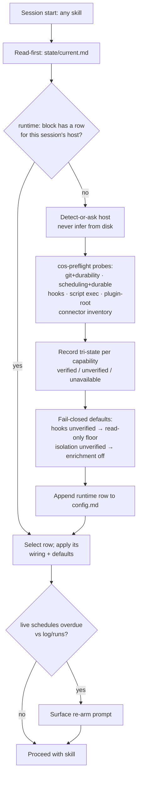
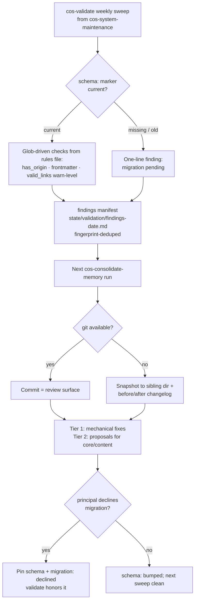

# feat: Cowork-first setup and structured-output consistency

## Summary

Make the plugin installable and honest on Claude Cowork (runtime preflight, three documented install paths, no-git fallback, corrected connector guidance), and make every artifact the engine writes schema-consistent and machine-checkable (one frontmatter standard, canonical fact-line, per-skill output contracts, a shipped `cos-validate` sweep, and a one-time instance migration via the cold path).

## Problem Frame

The engine's discipline is good but enforced by prose convention. A structural review (2026-06-10/11) found: Cowork support exists only as scattered caveats ("unverified as of 2026-06") rather than an install path; web research confirms Cowork **does not fire settings.json hooks** but **does** support plugins, slash-command skills, scheduled tasks, and git — so the current hook-centric safety wiring silently degrades there. On the output side, templates drift (`created` vs `date`, unquoted ranges, `origin: derived` outside the documented enum), five artifact templates lack filename patterns, and the live dev instance shows the leakage (missing `person_enrichment` block, missing `last_enriched`/`enrich` keys, briefs missing `meeting:`/`when:`). The eval harness already contains reusable deterministic checks (`engine/eval/lib/assertions.py`) but nothing ships them to instances.

---

## Requirements

**Cowork setup (A)**

- R1. A user with no terminal can install the plugin in Cowork, run `/cos-onboarding`, and end with a working instance whose `config.md` records what their runtime verifiably supports.
- R2. Runtime capabilities are probed (not assumed) and recorded per-runtime, with tri-state results (`verified | unverified | unavailable`) and fail-closed defaults: unverified hooks ⇒ read-only OAuth floor; unverified isolation ⇒ `person_enrichment.enabled: false`.
- R3. An instance opened from a second runtime (e.g., onboarded in Cowork, later opened in Claude Code) selects the matching capability row per session; it never applies another runtime's wiring.
- R4. Existing (pre-upgrade) instances can acquire the preflight block without re-seeding.
- R5. Connector guidance is correct per surface: plugin-tab connectors (Granola/Zoom/Fathom/Fireflies/Slack) vs Anthropic built-ins (Gmail/GCal/Drive via Customize → Connectors); all stale "Google is bundled" claims removed.
- R6. Instances without git keep the safety story: dated snapshots with retention, and a before/after changelog as the cold-path review surface; `engine/INSTRUCTIONS.md` §2/§9 reworded to match.
- R7. Cowork schedule expiry (~7 days, app-open only) is detected and surfaced — `config.md` never silently claims `live` for dead schedules.

**Structured output (B)**

- R8. One frontmatter standard: artifact docs carry `date` (+ `# filename:` pattern comment, quoted range values); entities carry `last_touched`; origin enum documented at every use site; capture footer pins ISO 8601 datetime with explicit offset.
- R9. `derived` joins the origin enum with defined trust semantics; the enum is single-sourced for validation with a CI equality check against the intentionally self-contained hook copy.
- R10. Canonical fact-line format `{{fact}} (origin, YYYY-MM-DD, source: …)` in the six semantic entity templates (person, account, competitor, project, concept, relationship) and episodic outcome lines; supersede stamping (`valid_until`) keeps a defined slot compatible with `write-back.md` §3/§5.
- R11. Every skill's SKILL.md carries an output-contract table (template · path pattern · required frontmatter keys), backed by one machine-readable rules file the validator consumes.
- R12. A deterministic, dependency-free `cos-validate` sweep runs weekly from `cos-system-maintenance`; findings flow to the next cold-path run for fixing (never fixed by the hot path), with fingerprint dedup so open items aren't re-reported weekly.
- R13. Existing instances migrate to the new schema via the cold path: per-file, idempotent, resumable, gated on a `schema:` marker, reviewable (git diff or snapshot+changelog), with an explicit declined/deferred state.
- R14. Daily skills read both formats and write the new one during the migration window.

**Release**

- R15. Eval suite and CI stay green throughout; goldens (scenarios 01, 03) re-schema'd; CI gains lockstep guards (4-manifest version equality, root `CLAUDE.md`/`AGENTS.md` mirror check).
- R16. One release at the end: version bump in all four manifest JSONs, `PUBLISH.md` validation table updated, stale `PUBLISH.md` cwd claim fixed.

---

## Key Technical Decisions

- KTD1 — **Validation ships as a weekly skill step, not a hook.** Cowork does not fire PreToolUse/PostToolUse (support docs + anthropics/claude-code#63360). The deterministic sweep is portable everywhere; `provenance_check.py` remains a Claude-Code-only bonus layer. Rejected: hook-only enforcement (dead on Cowork); LLM-judged validation (violates the eval harness's structural-by-construction rule, `engine/eval/JUDGING.md`).
- KTD2 — **`runtime:` block is per-runtime-keyed rows; sessions select, never overwrite.** Runtime is a session property, not an instance property — the same folder gets opened from multiple hosts. Detect-or-ask per session (never inferred from disk; the Cowork-with-CLI-artifacts mis-detection case from `engine/docs/U9-connector-capability-spike.md` is the canonical trap); probe only on missing row.
- KTD3 — **A `schema:` integer in `config.md` frontmatter gates everything.** Written by onboarding (new instances) and migration (existing). `cos-validate` reports one line ("migration pending") on legacy instances instead of hundreds of findings; migration becomes idempotent and resumable.
- KTD4 — **`derived` is added to the origin enum**, semantics: assembled from existing memory; trust follows the weakest contributing source; never a basis for outward action without underlying `confirmed`/`observed` facts. Seven shipped artifact templates already use it; exempting artifacts would blind the validator instead. Single source: `engine/eval/lib/schema.py`; `provenance_check.py` stays self-contained by design, with a pytest equality check.
- KTD5 — **Preflight is a standalone skill (`cos-preflight`)** invoked by onboarding as Step 0b and runnable on its own — that's the upgrade path for existing instances (R4). Rejected: burying it in onboarding (upgraders never re-run onboarding; its re-seed gate actively discourages it).
- KTD6 — **Preflight runs before instance-location confirmation.** Location advice is runtime-dependent (Cowork's "home" is a VM; `~/Documents` advice is wrong there). Onboarding order becomes: 0b preflight → 0a location → 0 connectors.
- KTD7 — **Findings manifest, cold-path fixer.** `cos-validate` writes `state/validation/findings-<date>.md`; the next `cos-consolidate-memory` run consumes it — mechanical frontmatter fixes as Tier 1 (changelog), anything touching `core/` or fact content as Tier 2 proposals. The hot path stays append-only; `cos-system-maintenance` stays `mutates: false`.
- KTD8 — **No-git fallback: sibling snapshot directory** (`<instance>-snapshots/<date>/`, excluded from itself, default retention 3), snapshot-before-consolidation mandatory, before/after file list in the changelog as the review surface. Snapshots inherit `sources/` pruning so PII retention guarantees survive (the in-instance copy alternative breaks `retention_until`).
- KTD9 — **Workstream B's schema standard lands before A's config changes** so the new `runtime:` block is born conformant; both workstreams ship in one version bump at the end. Four files are shared between workstreams (`engine/templates/config.md`, `cos-onboarding/SKILL.md`, `cos-consolidate-memory/SKILL.md`, README) — sequencing beats merge pain.
- KTD10 — **Schedule-expiry watchdog lives in the read-first step.** Any interactive run compares `schedules:` cadence against `log/runs/` recency; overdue `live` schedules on an expiring runtime surface a re-arm prompt. A scheduled watchdog can't work — on Cowork the watchdog itself expires.

---

## High-Level Technical Design

Preflight and per-session runtime selection (A):

Validation → migration → fix loop (B):

---

## Implementation Units

### Phase 1 — schema standard (B foundation)

### U1. Frontmatter standard, origin enum, fact-line format

- **Goal:** One documented schema across all templates and the methods that govern them.
- **Requirements:** R8, R9 (doc side), R10.
- **Dependencies:** none.
- **Files:** `engine/INSTRUCTIONS.md` (§6 enum + `derived`), `engine/templates/*.md` (all 27: artifact docs get `date` + `# filename:` + quoted ranges; entities get enum comments; `capture-footer.md` pins `YYYY-MM-DDTHH:MM±HH:MM`, principal-local offset, UTC when unknown), `engine/methods/write-back.md` (supersede-line slot compatible with the fact-line), `engine/skills/cos-onboarding/SKILL.md` (frontmatter `run:` → `cadence: once`).
- **Approach:** Decide once, apply everywhere: `{{curly}}` = fillable, `<angle>` = schema docs only; fact-line `{{fact}} (origin, YYYY-MM-DD, source: …)` with superseded form appending `valid_until: YYYY-MM-DD`. Glossary and `source-summary.md` are explicitly out of fact-line scope. Goals snapshots keep `YYYY-MM` granularity — document it as intentional.
- **Patterns to follow:** scenario 03 goldens (`engine/eval/scenarios/03-person-web-enrichment/golden/`) are the freshest expression of the de-facto schema — extend, don't contradict.
- **Test scenarios:** none executable in this unit alone — schema assertions land in U3/U8; this unit's check is the eval suite still passing unmodified goldens until U3 updates them. `Test expectation: none — documentation/template unit; verified via U3.`
- **Verification:** every template parses with `engine/eval/lib/frontmatter.py` (both pyyaml and fallback paths); no template uses `created` except `config.md`'s documented exception removed.

### U2. Output contracts: rules file + SKILL.md tables

- **Goal:** Machine-readable single source of output contracts; human-readable mirror in each skill.
- **Requirements:** R11.
- **Dependencies:** U1.
- **Files:** create `engine/eval/lib/schema.py` (origin enum + per-artifact-type required keys + path patterns), create `engine/eval/lib/test_schema.py`, modify all 11 `engine/skills/*/SKILL.md` (add a fixed-shape "Output contract" table), `engine/eval/hooks/provenance_check.py` untouched (self-contained by design) + pytest equality check between its enum and `schema.py`.
- **Approach:** `schema.py` is data (dicts), no logic — `assertions.py` and the U8 sweep both import it. SKILL.md tables carry: template · output path pattern · required frontmatter keys · capture-footer note. Explicit exclusions listed (`queue/`, `log/`, `state/` tables have no `origin`).
- **Patterns to follow:** `engine/eval/lib/outbound.py` (existing pattern of production code importing `frontmatter.py`); plan `docs/plans/2026-06-10-001-feat-outward-action-gate-plan.md` for module shape.
- **Test scenarios:** enum equality `schema.py` ↔ `provenance_check.py` ↔ `assertions.py:VALID_ORIGINS`; every artifact type in `schema.py` corresponds to an existing template file; every SKILL.md output-contract table names a template that exists (parse tables in a pytest).
- **Verification:** `pytest engine/eval -q` green with the new tests.

### U3. Eval goldens re-schema + CI lockstep guards

- **Goal:** Eval suite expresses the new schema; CI catches lockstep violations.
- **Requirements:** R15.
- **Dependencies:** U1, U2.
- **Files:** `engine/eval/scenarios/01-write-back-loop/golden/**` and `expected.yaml`, `engine/eval/scenarios/03-person-web-enrichment/golden/**` and `expected.yaml`, `engine/eval/run_all.py` (add manifest-version-equality + root-mirror assertions), `.github/workflows/eval.yml` (path triggers for the 4 manifests and root `CLAUDE.md`/`AGENTS.md`).
- **Approach:** Goldens updated file-by-file to the U1 standard; `expected.yaml` gains `frontmatter_eq`/`has_origin` checks exercising `derived`. The mirror check is a normalized diff (tolerating the documented `/cos-*` vs `$cos-*` and "by Codex" deltas).
- **Patterns to follow:** existing `expected.yaml` assertion vocabulary in scenario 01.
- **Test scenarios:** `run_all.py` exits non-zero when one manifest version is bumped alone; exits non-zero when root `CLAUDE.md` and `AGENTS.md` diverge beyond the tolerated deltas; both scenarios pass post-re-schema (happy path).
- **Verification:** `python3 engine/eval/run_all.py` → all green; `pytest engine/eval -q` green.

### Phase 2 — Cowork path (A)

### U4. `cos-preflight` skill + per-session runtime selection

- **Goal:** Probed, recorded, per-runtime capability state; honest degradation.
- **Requirements:** R1, R2, R3, R4, R7.
- **Dependencies:** U1 (config schema settled).
- **Files:** create `engine/skills/cos-preflight/SKILL.md`, modify `engine/templates/config.md` (new `runtime:` keyed block + `schema:` frontmatter field + `person_enrichment.enabled` default driven by preflight result), `engine/skills/cos-onboarding/SKILL.md` (Step 0b invokes preflight; step order 0b → 0a → 0; Step 7 branches read preflight rows instead of re-detecting), `engine/INSTRUCTIONS.md` (§3 read-first gains the runtime-row selection + schedule-liveness check, KTD10).
- **Approach:** Probes: git present + repo-durability note; scheduling tool + durability (`registered_via`, expiry); hooks tri-state (Cowork = `unavailable` per docs — record citation, don't canary outward); script execution (python3, exec rights); plugin-root resolution; connector inventory. Each row: capability → `verified|unverified|unavailable` + `last_verified`. `cos-system-maintenance` re-probes `unverified` rows weekly. Preflight is the only writer of the block; the scheduled cold path never fabricates it.
- **Patterns to follow:** `engine/docs/U0-capability-spike.md` and `U9-connector-capability-spike.md` (probe semantics, detect-or-ask rule); `engine/skills/cos-extract-from-sources/SKILL.md` frontmatter for a non-user-facing skill shape.
- **Test scenarios:** new eval scenario or pytest: config with a Cowork row + Claude Code session → selection picks/creates the right row without overwriting; missing block on legacy instance → preflight offer, not failure; `person_enrichment` forced false when isolation row is `unverified`; overdue `live` schedule vs `log/runs/` recency → re-arm finding surfaces.
- **Verification:** dry-run onboarding transcript on this repo's dev `instance/` produces a conformant `runtime:` block; eval green.

### U5. Connector truth + onboarding/doc corrections

- **Goal:** No user is routed to a Connect button that doesn't exist.
- **Requirements:** R5.
- **Dependencies:** U4 (step renumbering).
- **Files:** `engine/methods/connectors.md` (remove/correct the three stale Google-bundling claims; Cowork recipe routes Gmail/GCal/Drive to Customize → Connectors; add marketplace re-sync note), `engine/skills/cos-onboarding/SKILL.md` (Step 0 connector wording per surface, Cowork built-in inventory caveat — built-ins not probeable until account-level connect), create `engine/docs/connector-checklist.md` (one page: what's in the plugin tab, what's built-in, per-surface), `engine/templates/getting-started.md` (link the checklist; expiry-aware schedule status vocabulary), `engine/docs/U0-capability-spike.md` + `engine/docs/write-isolation-config.md` (discharge the "verify once" residuals with the now-documented facts: hooks don't fire on Cowork — cite anthropics/claude-code#63360).
- **Approach:** Single checklist doc is the canonical connector table; other files point at it instead of restating.
- **Patterns to follow:** existing tone/structure of `engine/methods/connectors.md`.
- **Test scenarios:** `Test expectation: none — documentation unit.` Grep-level check: no remaining occurrence of Google MCP URLs or "Google … plugin's Connectors tab" claims outside the dead-end explanation.
- **Verification:** the three locations flagged in review (connectors.md two places, onboarding Step 0) read correctly; checklist doc linked from README (U7).

### U6. No-git fallback

- **Goal:** Safety story holds without git.
- **Requirements:** R6.
- **Dependencies:** U4.
- **Files:** `engine/skills/cos-onboarding/SKILL.md` (Step 7: git-init when available, else snapshot wiring), `engine/skills/cos-consolidate-memory/SKILL.md` (snapshot-before-edit + before/after changelog when no git), `engine/INSTRUCTIONS.md` (§2 and §9 reworded: "git commit where available; dated snapshot + changelog otherwise"), `engine/templates/consolidation-changelog.md` (before/after file-list section), `instance/.backup-instructions.md`-template equivalent if shipped (verify; else onboarding writes it).
- **Approach:** KTD8 mechanics: sibling dir, retention 3, inherits `sources/` pruning. Snapshot is mandatory pre-migration and pre-consolidation on no-git instances.
- **Patterns to follow:** existing `.backup-instructions.md` in the dev instance.
- **Test scenarios:** consolidation on a git-less fixture creates `<instance>-snapshots/<date>/` and a changelog with before/after list; 4th snapshot prunes the oldest; pruned `sources/` files absent from new snapshots.
- **Verification:** eval scenario or pytest covering the snapshot path; INSTRUCTIONS wording contains no unconditional "is a git commit" claim.

### U7. Install docs: three paths

- **Goal:** A Cowork user, a Claude Code user, and a cloner each get a correct, complete path.
- **Requirements:** R1 (doc side), R16 (stale claim).
- **Dependencies:** U5 (checklist exists).
- **Files:** `README.md`, `INSTALL.md`, `PUBLISH.md` (Cowork section: Customize → Plugins → Browse; fix the line claiming onboarding creates `instance/` in cwd; per-runtime support-level table — Cursor/Codex stated honestly, `setup.sh` wires `.claude`/`.agents` only).
- **Approach:** Symlink story scoped to the clone path explicitly; marketplace paths state that `setup.sh` is not used and must not be mixed.
- **Patterns to follow:** current INSTALL.md table style.
- **Test scenarios:** `Test expectation: none — documentation unit.`
- **Verification:** each of the three paths readable end-to-end without referencing the others; PUBLISH validation table row added for Cowork.

### Phase 3 — validation, migration, release

### U8. `cos-validate` sweep

- **Goal:** Deterministic weekly instance validation, findings routed to the cold path.
- **Requirements:** R12, R9 (enforcement side).
- **Dependencies:** U2, U4 (schema marker + script-exec probe).
- **Files:** create `engine/eval/validate_instance.py` (glob-driver CLI: `--instance <path>`, rules from `schema.py`), create `engine/eval/lib/test_validate.py`, modify `engine/skills/cos-system-maintenance/SKILL.md` (invoke sweep; report; never edit memory), `engine/skills/cos-consolidate-memory/SKILL.md` (consume findings manifest: Tier 1 mechanical / Tier 2 proposal, fingerprint dedup), `engine/templates/system-maintenance-note.md` (validation summary section).
- **Approach:** Dependency-free (fallback parser path); `valid_links` warn-level; path exclusions from `schema.py`; `schema:` gate per KTD3; degraded outcome on runtimes where script exec is `unavailable`: report "validation unavailable", never an LLM approximation.
- **Patterns to follow:** `engine/eval/run_scenario.py` driver shape; `assertions.py` check signatures.
- **Test scenarios:** clean post-migration fixture → zero findings; legacy fixture (no `schema:`) → exactly one "migration pending" finding; fixture with bad origin → `has_origin` finding with file+key fingerprint; same fixture swept twice → manifest dedups; pyyaml absent → sweep still runs (fallback parser); dangling wikilink → warn, exit 0.
- **Verification:** `python3 engine/eval/validate_instance.py --instance engine/eval/scenarios/01-write-back-loop/golden` → zero findings post-U3.

### U9. One-time schema migration (cold path)

- **Goal:** Existing instances reach `schema: 1` safely.
- **Requirements:** R13, R14.
- **Dependencies:** U8 (worklist comes from validate findings).
- **Files:** `engine/skills/cos-consolidate-memory/SKILL.md` (migration procedure section), `engine/methods/write-back.md` (migration = Tier 1 for mechanical key renames, Tier 2 for anything ambiguous; declined state `migration: declined` pinned in config frontmatter), daily-skill SKILL.mds touched in U2 get a one-line "read both formats, write new while `schema:` < 1" note.
- **Approach:** Per-file idempotent transform driven by the validate worklist — resumable, incremental commits where git exists, snapshot-first otherwise (U6). Never one mega-edit (context exhaustion on large instances is the expected failure mode).
- **Patterns to follow:** supersede mechanics in `write-back.md` §3/§5.
- **Test scenarios:** legacy golden copy migrated → equals new-schema golden (key renames, quoted ranges, enum comments not required in instances — frontmatter values only); interrupting after N files and re-running completes without re-editing done files; declined state → validate reports one suppressed-by-decline line, no weekly retry; `runtime:` block absent → migration proceeds without fabricating it.
- **Verification:** migration run against a copy of the live instance (`~/chief-of-staff/instance`) produces a reviewable diff that fixes the three known drifts (missing `person_enrichment`, missing `last_enriched`/`enrich`, brief frontmatter) — this is the dogfood acceptance.
- **Execution note:** write the migration test fixtures first (legacy → expected pairs) before the procedure text — they pin the transform's exact semantics.

### U10. Release

- **Goal:** One coherent ship.
- **Requirements:** R15, R16.
- **Dependencies:** U1–U9.
- **Files:** `engine/.claude-plugin/plugin.json`, `engine/.codex-plugin/plugin.json`, `engine/.cursor-plugin/plugin.json`, `.cursor-plugin/marketplace.json` (lockstep bump → 0.6.0), `PUBLISH.md` (validation table), root `CLAUDE.md` + `AGENTS.md` (mirrored skill-list updates incl. `cos-preflight`).
- **Approach:** Bump last; U3's CI guards make lockstep enforced, not remembered.
- **Test scenarios:** CI green on the release commit (the U3 guards are the test).
- **Verification:** `/plugin` update on this machine picks up 0.6.0; fresh onboarding dry-run produces a zero-findings instance.

---

## Scope Boundaries

In scope: everything above. The live-instance patch (`~/chief-of-staff/instance`) is delivered by running U9's migration against it after release — not by hand-editing ahead of the schema.

### Deferred to Follow-Up Work

- `engine/eval/hooks/` → `engine/hooks/` rename (inherited wart, deferred by plan 2026-06-10-001 §Deferred — keep deferring; U2/U8 don't deepen the coupling).
- Scenario `02-outbound-gate` lacks `expected.yaml` (silently excluded from `run_all.py`) — completing it is plan-001 follow-up territory.
- `setup.sh` `.cursor` wiring / full Cursor clone-path support.
- Org-wide Cowork plugin distribution (Anthropic ships this later; revisit).

### Outside this product's identity

- Vector/graph retrieval layer (`instance/index/`) — explicitly v1-deferred in `engine/INSTRUCTIONS.md` §7.
- Any automation that sends outward without the proposal queue.

---

## Risks & Dependencies

- **Cowork behavior may shift under us** — it's a fast-moving product (plugins beta Jan 2026, GA Apr 2026). Mitigation: preflight probes rather than hardcoded assumptions; tri-state rows with `last_verified`; weekly re-probe of `unverified`.
- **`${CLAUDE_PLUGIN_ROOT}` resolution on Cowork is undocumented.** U4 probes it; skills already use plugin-relative paths. If it fails, onboarding falls back to copying needed templates into the instance (decision deferred to implementation, surfaced in U4).
- **Migration on large instances** — context exhaustion. Mitigated by worklist-driven per-file transform (U9), but instances larger than the dev fixture are untested; the resumability tests are the guard.
- **Enum change touches trust semantics** (`derived`, KTD4) — `engine/INSTRUCTIONS.md` §6 is load-bearing for the safety floor; wording reviewed against `write-back.md` §8 promotion rules in U1.

---

## Open Questions

- Does Cowork's plugin install expose the plugin's `.mcp.json` servers in a Connectors tab today, and does marketplace re-sync surface newly added ones? Believed yes (docs imply it); U4/U5 verify on a real Cowork session and adjust the checklist wording — implementation-time discovery, not a planning blocker.

---

## Sources & Research

- Structural review audits (this session, 2026-06-10/11): skills/templates consistency, setup-doc contradictions, live-instance drift.
- `engine/docs/U0-capability-spike.md`, `engine/docs/U9-connector-capability-spike.md`, `engine/docs/write-isolation-config.md` — prior capability learnings honored (detect-or-ask, no Google bundling, per-run isolation).
- Cowork capability matrix (official docs): plugins supported (support.claude.com 13837440), scheduled tasks + 7-day expiry (13854387), hooks not fired (anthropics/claude-code#63360), built-in connectors (10166901), remote-MCP requirement (11175166).
- Eval harness internals: `engine/eval/lib/assertions.py` (9 data-driven checks, `VALID_ORIGINS`), `engine/eval/lib/frontmatter.py` (dependency-optional parser), `engine/eval/README.md` (structural-vs-judge contract), CI `.github/workflows/eval.yml` (green: 32 checks, 42 pytest).
- Flow analysis (26 findings, 2026-06-11) — critical findings resolved as KTD2/KTD3/KTD7/KTD8/KTD10 and R7/R13/R14.
